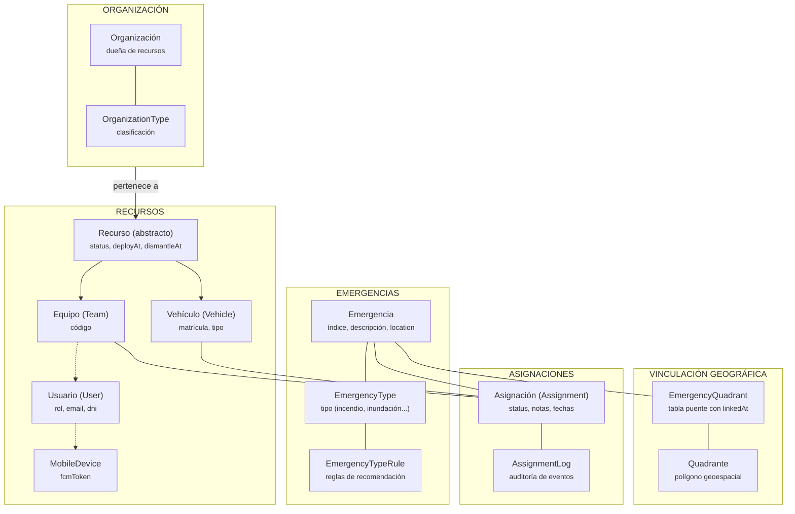

# Jerarquía de Datos - Backend

**Niveles jerárquicos:**

| Nivel | Entidad | Dependencia |
|-------|---------|-------------|
| 1 | **Organización** | Raíz organizativa |
| 2 | **Recurso** (Team/Vehicle) | Pertenece a Organización |
| 3 | **Usuario** | Pertenece a Team |
| 4 | **MobileDevice** | 1:1 con Usuario |
| 1 | **Emergencia** | Raíz operativa |
| 2 | **EmergencyType** | Clasifica Emergencia |
| 2 | **EmergencyQuadrant / Quadrant** | Vinculación geográfica |
| 2 | **Assignment** | Puente Emergencia ↔ Recurso |
| 3 | **AssignmentLog** | Auditoría de Assignment |
